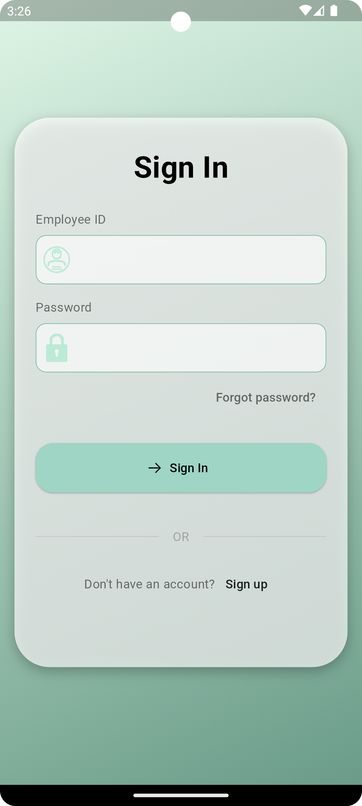
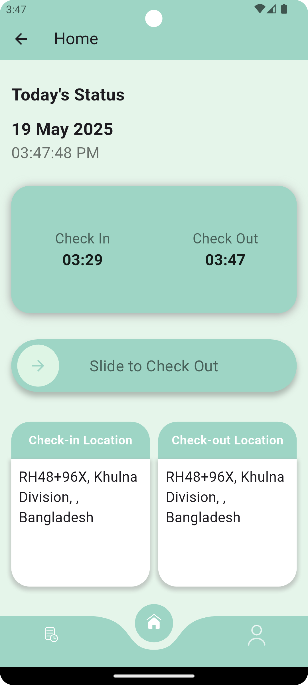
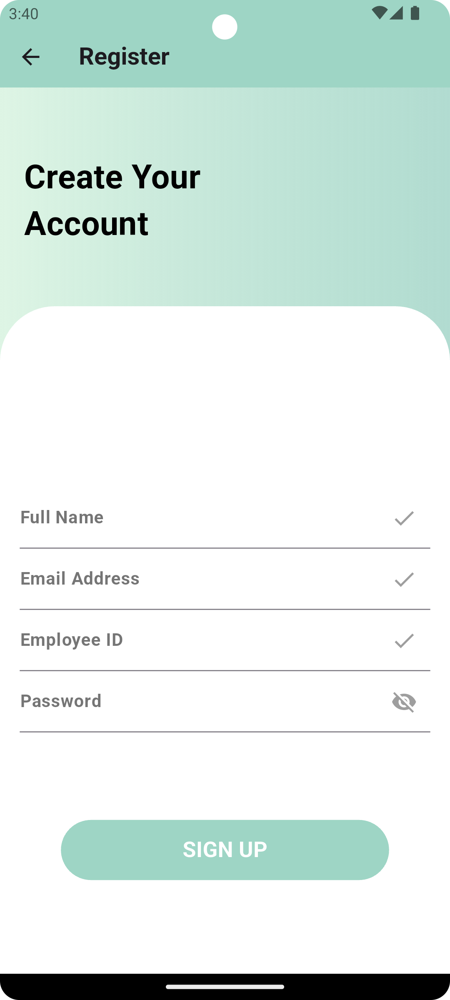

# 📱 AttendEase

## Project Details  
- **Language**: Dart (Flutter)  
- **Tools & SDKs**: Flutter, Firebase Realtime Database  
- **IDE**: Android Studio

---

## App Overview

**AttendEase** is an employee attendance tracking app built with Flutter. With real-time syncing to Firebase and location tagging for attendance validation, it simplifies attendance management in workplaces. The app allows employees to quickly mark their daily attendance, view their attendance history, and helps employers maintain accurate and organized records.

---
##  Key Features
-  Real-time attendance syncing with Firebase  
-  Location-based check-in and check-out  
-  Organized data tracking for employers

--- 
##  User Interface

  
  
  
  
  
  

  
  
  
  
  
  

